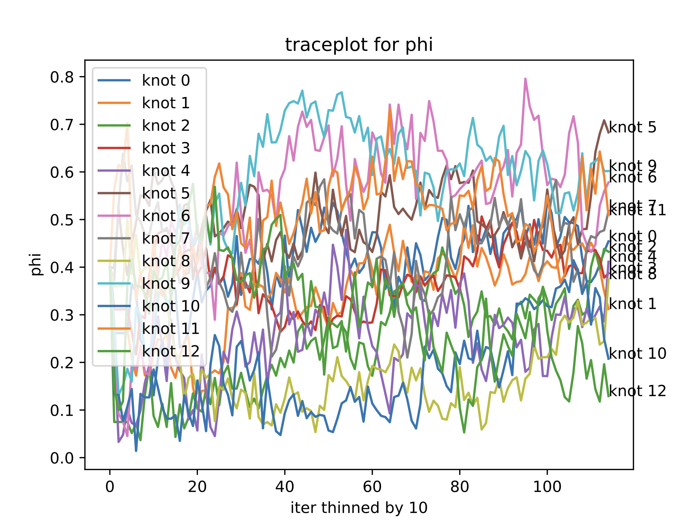
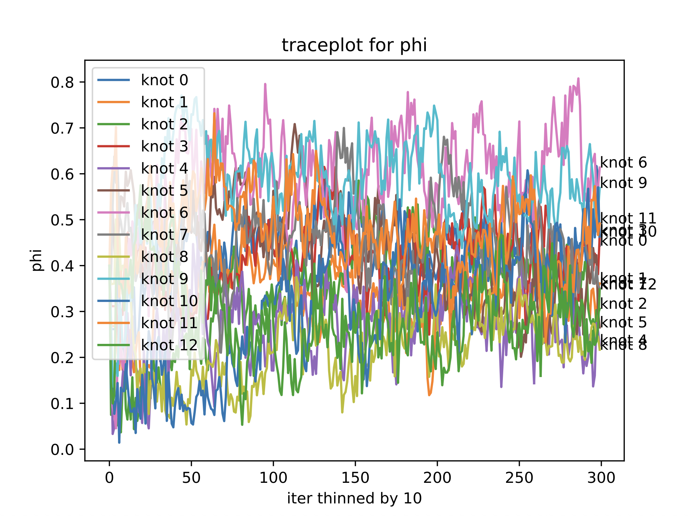
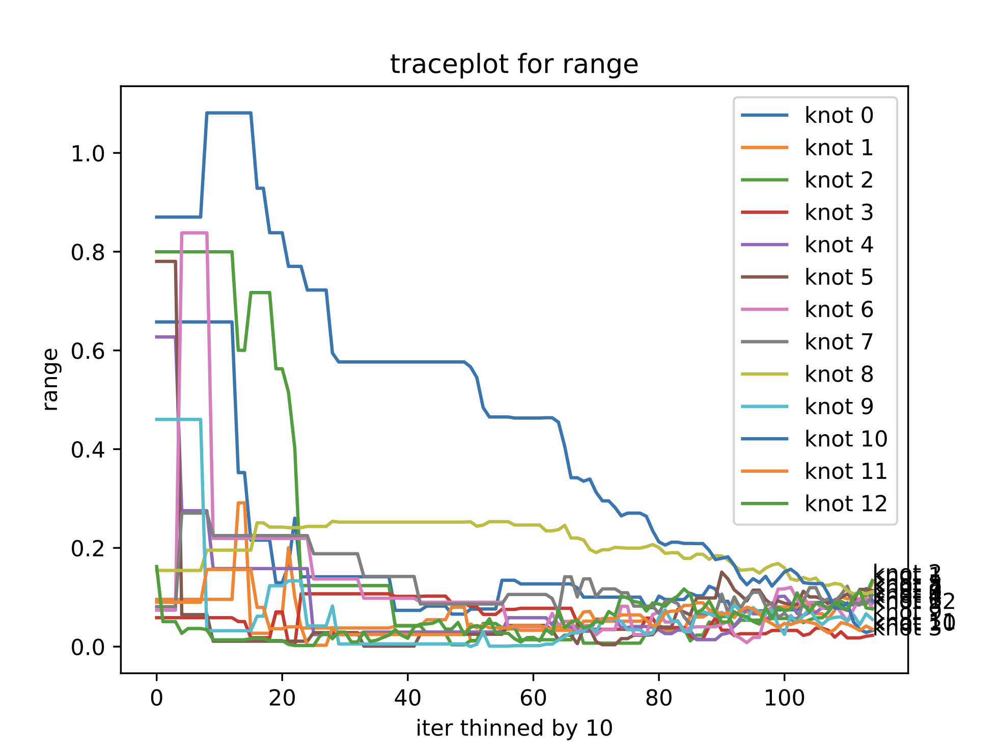
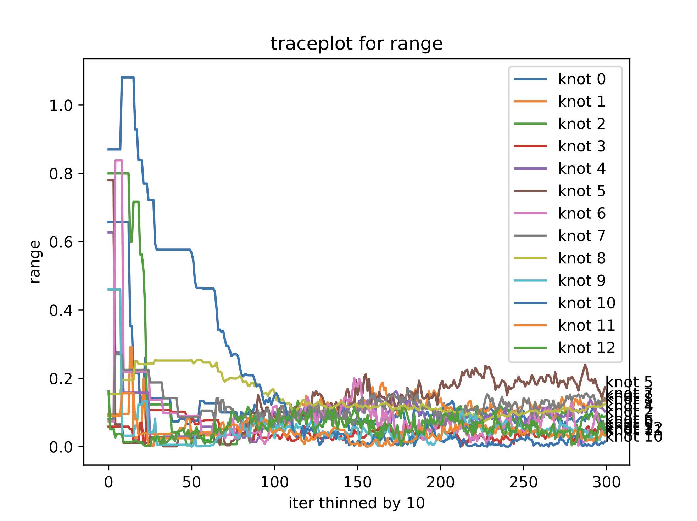
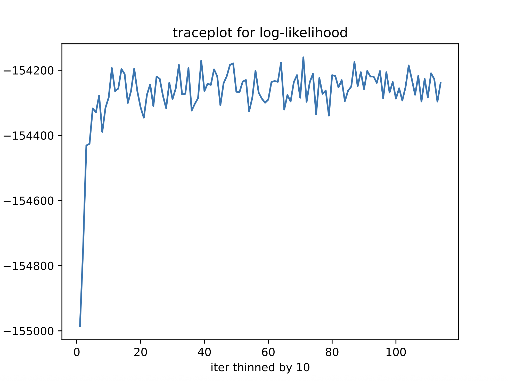
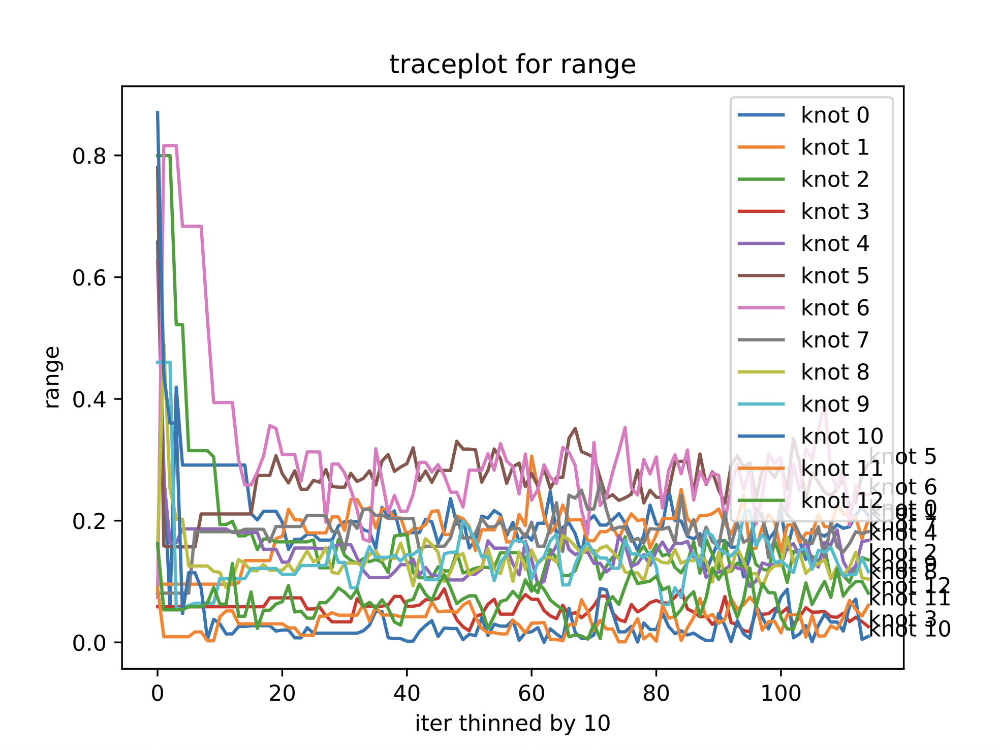

# Meeting Summaries on GEV Project

## June 12 (Thursday) Muyang/Ben

- keep queueing chains until they finish (for the paper)

For EVA:
- [ ] Use the current chains to make posterior plots
  - Send the boxplot comparisons to Ben
- [ ] Make edits to the slides

- [ ] Run shortest chains using emulated `qRW` (Modify sampler)

## June 4 (Wednesday) Muyang/Likun/Ben

- Priority is to keep running the current chains
  - Additional Alpine Allocation
    - Queue time starts to lengthen to days...
    - [Form](https://colostate.sharepoint.com/sites/Division_Research_Computing_and_Cyberinfrastructure/Shared%20Documents/Forms/AllItems.aspx?id=%2Fsites%2FDivision%5FResearch%5FComputing%5Fand%5FCyberinfrastructure%2FShared%20Documents%2FGeneral%2FPUBLIC%2DWEB%2DCONTENT%2FAlpine%20Project%20Allocation%20Request%20Process%2Epdf&parent=%2Fsites%2FDivision%5FResearch%5FComputing%5Fand%5FCyberinfrastructure%2FShared%20Documents%2FGeneral%2FPUBLIC%2DWEB%2DCONTENT&p=true&ga=1)
  - History
    - 20250606 backed up and requeued
      - stationary converged?
      - `k13r4b4m` converged?
    - 20250608 backed up and requeued
      - `k25r2b0.67m` converged?
      - `k25r4b4m` converged?
      - `k25r2b2m` converged?
    - 20250610 backed up and requeued
    - 20250611 backed up and requeued

- Emulate the quantile funciton
  - Current results - MLP-WMSE-softplus
    - 
    - 
    - 
    - 
    - 
    - 
    - 
    - 
    - 
    - 
  - [x] $H(y)$ transformed
    - 
    - 
    - 
    - 
    - 
    - 
    - 
    - 
    - 
    - 
    - 
    - 
    - 
    - 
    - 
  - [x] Simulate dataset marginal/profile likelihood
    - using $H(y)$ transformation:
    - 
    - 
    - 
    - 
    - 
    - 
    - 
  - [ ] piece-wise like Likun suggested

- Not a huge rush, but would be good to see if GEV + *standard* Pareto work


## June 2 (Monday) Muyang/Ben

- [x] Backup and Requeue the chains
  - 20250601
  - 20250602
  - 20250603

- [x] Pure AI model diagnostics and evaluation
  - results generated. 
    - $\chi$-plot looks flat. 
    - Show predicative likelihood boxplot.

- [-] emulate the quantile function
  - fix bug and carry out the weighted MSE method
  - tryout the EV-GAN method

- [-] GEV + *standard* Pareto + trancated proposal range?
  - Going to be super fast, because no numerical integration
  - nah, it will require additional coverage analysis
  - Ben: It's better if the distributions are in closed forms (than emulating the quantile function)


## May 28 (Wednesday) Meeting Muyang/Likun/Ben

- [x] Put a contour at 0.5 for the $\phi(s)$ surface
- [x] Run the fixed marginal models on Alpine

  | Model Config     | Fixed Marginals     |
  |------------------|---------------------|
  | k13r4b4          | k13r4b4m            |
  | k25r2b0.67       | k25r2b0.67m         |
  | k25r2b2          | k25r2b2m            |
  | k25r4b4          | k25r4b4m            |
  | k41r1.6b0.43     | k41r1.6b0.43m       |
  | k41r2b0.67       | k41r2b0.67m         |
  | stationary       | —                   |

- Take a try on emulating the quantile function for GEV
  - [x] Try out what we did for GPD directly moved here
    - multi-layer perceptron for (p, phi, gamma) --> X
    - Using the same specification as the GPD's `qRW` function leads to log error too small? But how can the error be negative?? -- `y_true` is also log-transformed, so the weights = 1 + $\alpha \cdot$ `y_true` could be potentially negative and then weights $\times$ squared error gives negative loss. (This didn't happen in GPD because at `p=0.95` we don't have `log(y_true)` that is negative.)
    ```
    24415/24415 - 65s - 3ms/step - loss: -2.5071e+05 - val_loss: -8.1675e+05
    Epoch 2/100
    24415/24415 - 43s - 2ms/step - loss: -1.9503e+06 - val_loss: -3.3251e+06
    Epoch 3/100
    24415/24415 - 45s - 2ms/step - loss: -5.2034e+06 - val_loss: -7.2660e+06
    Epoch 4/100
    24415/24415 - 49s - 2ms/step - loss: -9.7970e+06 - val_loss: -1.2459e+07
    Epoch 5/100
    24415/24415 - 62s - 3ms/step - loss: -1.5551e+07 - val_loss: -1.8705e+07
    Epoch 6/100
    24415/24415 - 104s - 4ms/step - loss: nan - val_loss: nan
    Epoch 7/100
    24415/24415 - 50s - 2ms/step - loss: nan - val_loss: nan
    Epoch 8/100
    24415/24415 - 43s - 2ms/step - loss: nan - val_loss: nan
    Epoch 9/100
    24415/24415 - 43s - 2ms/step - loss: nan - val_loss: nan
    Epoch 10/100
    24415/24415 - 46s - 2ms/step - loss: nan - val_loss: nan
    Epoch 11/100
    24415/24415 - 55s - 2ms/step - loss: nan - val_loss: nan
    Epoch 12/100
    24415/24415 - 112s - 5ms/step - loss: nan - val_loss: nan
    Epoch 13/100
    ```
    - [x] use `weight = 1 + alpha * softplus(y_true)`?
    - [-] use piece-wise emulator, one for 0.1 to 0.9, one for 0.9 to 0.9999?
  - [-] Try out the EV-GAN transformation
    - $H(y) = -\log(y) / \left[\log(1-p^2) - \log(2)\right]$
    - $y = \exp \left\{-\hat{H}(y) \cdot \left[\log(1-p^2) - \log(2)\right]\right \}$

## May 22 (Thursday) Meeting Muyang/Likun/Ben

- [x] run the bug fix k13r4b4 model
  - Currently running on Misspiggy
  - If eventually we need to re-run all the application models, train a neural network to do the `qRW`
    - This might be necessary because
      - $\phi$ seems to be larger (potentially AD?)
      - 
      - 
      - $\rho$ becomes much smaller
      - 
      - 
    - small $\rho$ and large $\phi$: not much spatial correlation in the bulk, the tail dependence is highly localized (local storms)?
    - [x] make (preliminary) posterior summary plots
      - cleanup/organize the old code files
      - make posterior plots for
        - $\phi$
        - $\rho$
        - $\mu$, $\sigma$, $\xi$
        - $\chi$

- [x] fix the font size of axis on figures
  - Likun enlarged legend size on Figure 3
  - I enlarged Figure 4 axis labels
  - I enlarge Figure 5 axis labels

#### `qRW` emulator

- [x] Start all the other ten models on Alpine first
- [-] run the fixed marginal models as well
- [-] Then while they are running, try to figure out the quantile emulation

#### Pure AI Gaussian Model
- [x] run the pure AI model
  - [x] Alpine?
  - [x] Needs debugging on misspiggy
    - check marginal parameter ($\mu, \sigma, \xi$) proposals
  - Sampler working
    - 
    - 
    - likelihood prompt ValueError: inf or NaN 

### Reviewing old code

- `like_proposal` in range update
  - re-run the `k13r4b4` model to see how big of a difference this makes?
  - could be a "cat on keyboard" thing
    - the simulation/coverage code does not have this typo
    - only involved in the application (`MCMC_daisychain.py`)

- Imputation does not involve likelihood ratio:
  - Because it's Gibbs sampling, we sample exactly from the full conditional distribution of the missing data.

- Python Pointer thing
  - `X_star_1t_current = X_star_1t_proposal` is a pointer copy. However, as long as each time `X_star_1t_proposal` is assigned a brand new generated array, it won't affect `X_star_1t_current` (i.e., as long as we don't do e.g. `X_star_1t_proposal[5] = 3.8`)
  - `lik_1t_current = lik_1t_proposal` is fine because they are values, so they are not pointer copies.

### Paper

- [x] JASA Format
  - 35 pages, including the title page, abstract, figures, tables, and references. (Appendices don't count towards the page limit)
  - 8.5 x 11 inch paper, 12 point fully double-spaced font

#### <u>More Minor edits per the JRSSB review comments</u>

- [x] "Consequently, random scale mixture models ... the tail index $\phi$"; "Neverthelss, the random scale mixture ... for the entire spatial domain".
  - For a fixed lag, only one class of tail dependence is possible
- [x] Hazra's AD or AI typo
- [x] Justification for the distributional choices
  - JRSSB includes the `Computation` section in the Appendix (where this is justified)
- [x] $C_\alpha$ not yet defined prior to Proposition 1
- [x] Add intuition/interpretation to the margins obtained in Proposition 1
- [x] $C_j$ notation
- [x] $\rho_{ij}$ in the AI theorem
- [x] Empirical $\chi$ and $\eta$ plot legend text too small
  - we provided description in caption
- [x] Empirical coverage rates of simulation study, explanation for the over-coverage?
  - nope we don't have justification
- [x] Be more explicit in Application section that we selected the same subset and compared to the Zhang et al. (2022) model

#### <u>More Major edits per the JRSSB review comments</u>

- [x] Is it possible to fit a simpler, pure AI submodel? cite some papers proposing models suitable for modeling spatial AI data?
  - Do a $X \sim N(0, \Sigma)$ model as pure AI model
  - [x] modify the marginal transformations
    - `dRW` --> `dZ`
    - `pRW` --> `pZ`
    - `qRW` --> `qZ`
  - [x] modify the likelihood function
    - $$L(\boldsymbol{Y_t} \mid \mu_t, \sigma, \xi, \boldsymbol{\rho}) = \varphi_D(\boldsymbol{Z_t} \mid 0, \boldsymbol{\Sigma_\rho}) \left\lvert\dfrac{\partial \boldsymbol{Z_t}}{\partial \boldsymbol{Y_t}}\right\rvert = \varphi_D(Z_t\mid \boldsymbol{0, \Sigma_\rho}) \cdot \prod_{i=1}^D\dfrac{f_{Y\mid \mu_t, \sigma, \xi}(y_t)}{\phi_{N(0,1)}(z)}$$
  - [x] modify the imputation code
  - [x] Modify the sampler code

- [x] assess to what extent the model is a significant improvement to existing ones
  - Use a dataset that highlight this model's performance
    - either real dataset or simulation study
  - Extend the `simulation and coverage analysis` section by comparing this method to Hazra
- [ ] Look at marginal GEV fit over time to spot if there is $\sigma_t$
  - Nah


## May 6 Meeting with Ben

- [ ] Change the typos in paper
  - use blue or some colored ink
- [ ] Do a $X \sim N(0, \Sigma)$ model as pure AI model
- [ ] Look at marginal GEV fit over time to spot if there is $\sigma_t$
- [ ] Ben: Potentially look at north east US?


## Dec. 9 Monday Meeting with Likun/Ben

- [x] JRSSB:
  - [x] link to code
  - [x] grant, double check with Ben
  - [x] cover letter?
  - [x] Data availability statement
  - [x] edit the section 6,7,8 heading spacings
  - Likun's edit in line
    - [x] Copy entire appendix over to the other one
    - [x] Likun's in-line changes are tracked
  - Ben's edit in line
    - [x] Tracked. Copy Over

- [x] EnviBayes:
  - After copy over the JRSSB changes, okay to submit.
  - Additional contents not included in JRSSB:
    - Computation section
    - Model Setup Table `tabel:application_knot`
    - Boxplot figure `fig:application_ll`
    - Posterior Mean table `table:application_estimate`

- [x] arXiv:
  - use the JRSSB's version because easier to match up with future edits (i.e., don't move things back)
    - [x] move things to appendix
  - send the link in email


(JSM 2025 Topic Contributed Paper Session):
- submitted

## Dec. 3 Tuesday Meeting with Likun/Mark/Ben

(JRSSB):
- Ben will edit the discussion session about stationary model
- Likun will add a lemma to the proof by Sunday
- [ ] Copy over the changes to the EnviBayes version

## Nov. 21 Thursday Meeting with Ben

- [x] Topic-contributed session:
  - Email Reetam, see if we can co-organize
    - If there are more people than spots available, then just keep emailing people
  - <mark>I think I'll just keep emailing people and put together mine</mark>

- [x] ASA `ENVR` paper competition
  - able to put back 
    - the computation section
    - the boxplot

- [x] Update the stationary model result with the most result chain iterations
  - update the boxplot figure

- [x] ISBA `EnviBayes` paper competition
  - Put somthing back, because reference is not counted
  - [x] Add stationary model
    - two sentences about the stationary model
    - eleven, not ten models
    - model description table
    - boxplot comparision figure
  - Prep this version for arXiv
  - <mark> Still have space</mark>
- [x] JRSSB
  - don't worry about it "looking-ugly"; no need to put anything back because it has already exceeded 30 pages
  - [x] Add stationary model
    - two sentences about the stationary model
    - eleven, not ten models
    - model description table
    - boxplot comparision figure
  - [x] use a software or latex package to convert to UK spelling
  - [x] Register my ORCID and use mine
  - [ ] Use `xr` to compile supplementary material separately
  - changed figure 2 caption in JRSSB
  - changed figure 3 size in JRSSB
  - modified references to delete url
  - give supplementary a standalone section. Tell readers what's included in it?
    - the supplemntary mateiral contains five appendices, including technical proofs, additioanl results, C,D, and E. 

## Nov. 15 Friday Meeting with Ben

- [ ] Make paper into JRSSB Format
  - check their website for "guide to the authors"
  - Already exceeding the 30-page limit
    - [ ] Move back the tables, the boxplots
    - [ ] Add the talk about stationary model
  - [ ] English/UK spelling
  - [ ] Two latex questions
    - [ ] Enumitem error
    - [ ] Supplementary Material
  - [ ] Use my ORCID?
- [x] Tweak paper slightly and submit to the [ENVR](https://community.amstat.org/envr/recognitionandawards/envrstudentpapercompetition) paper competition
  - no longer than 26 pages (inclusive of all figures, tables, and bibliography), so appendices is fine?


## Nov. 12 Tuesday Meeting with Ben/Likun/Mark

Note:

- [x] Make the double spaced version of the paper on the original Overleaf
  - Ben and Likun both have paid Overleaf account
  - [x] Make the edits that we made to the original main.tex today
  - [x] Change word colors
  - All necessary files and figures have been “flattened” and now reside directly under the root directory of the LaTeX project. Previously, our figures and .tex sections were nested within individual folders, but since arXiv needs a flattened structure, I made this adjustment.
  - **`main.tex`**: “the main branch.” This file contains the single-spaced, original version of the full paper, including the edits we discussed during today’s meeting. 
  - **`main_SBSS.tex`**: a “fork from the main branch.” This is the double-spaced version intended for the SBSS submission. Please use this file for any edits and shrinkings that are specific to the SBSS submission process.

- [x] Make predictive log-likelihood for the stationary model
  - Ben: use the first 3,000 iterations as burn in 
  - Predictive log-likelihood of those testing sites
    - Boxplot is made with `k1_r100`, not particularly worse actually among some of the best performing model
      - Do we want to include it?
      - Dataset is not particularly nonstationary, so that's why this model perform decent?
      - median of `k13_r4` is better than this
    - [x] If we want to add it to paper:
      - add as a one liner to the paragraph
        - Ben: no need to include in the SBSS
      - [x] add to the boxplot figure
      - [x] modify the table?
  - QQplot of the out-of-sample sites

- Condense the SBSS paper submission
  - requires:
    - 200 words abstract
    - 25 pages total
  - combine:
    - knots configuration plot with station plot
    - example station plot with $\chi$ $\eta$ plot
- Topic-Contributed Session JSM 2025
  - Topic-contributed paper sessions consist of five speakers, made up of at least three presenters and, at most, two discussants; each speaker has 20 minutes to present.
  - Session proposal includes a session title, general description of the session, list of participants, and tentative talk titles.
  - Preparation:
    - Session title
      - "XX XX Spatial Extremes?"
    - General description of the session (abstract)
      - (1) why this topic is important and relevant, 
      - (2) the focus and goal of the session, 
      - (3) what the speakers will discuss.
    - list of participant & tentative talk titles
      - Presenter: Ben Shaby
      - Presenter: Dan Cooley
      - Presenter: Jennifer Wadsworth
      - Presenter:
      - Discussant?
      - Can I present?
      - Can I ask Likun?
    - invitation letters
      - (1) the details of the conference and session, 
      - (2) the focus and goal of the session, 
      - (3) why you are inviting them or why you think they would be a good contribution to the session, 
      - (4) and the date you need for them to respond to you by


To Talk: 

- Check in on Paper 
  - Revert $\chi_{12}$ to UB and LB?
  - Go through the unresolved comments during meeting
    - Likun Section 1 Grey texts
    - Likun Section 2.4 Examples exponential-Gamma
    - Likun section 5.1 red colored text
  - Colored texts
    - Section 1 Ben added
    - Section 2 Proposition 2.2 (a)
  - 

- Schedule a Thursday's meeting with Ben 
  - paper submit to [`SBSS`](https://community.amstat.org/sbss/awards)
  - topic-contributed session

- Stationary model

### Nov. 5 Tuesday Meeting with Ben

- [x] Make a double spaced version of the paper, and see how long it is
  - Flatten (no folder structure)
  - Any other particular rules I should be aware of for `arXiv`?
  - Compile time too long. Anybody has overleaf account?

## Oct. 29 Tuesday Meeting with Likun/Mark/Ben

Paper:

- [Huser, Opitz, Thibaud 2017](<../../Research/Spatial Extreme/1 Papers/Bridging Asymptotic Independence and Dependence in Spatial Extremes Using Gaussian Scale Mixtures.pdf>)
- [Huser and Wadsworth 2019](<../../Research/Spatial Extreme/1 Papers/Modeling Spatial Processes with Unknown Extremal Dependence Class.pdf>)
- [Hazra et al.](<../../Desktop/Efficient Modeling of Spatial Extremes over Large Geographical Domains.pdf>)
- [Wadsworth 2024](<../../Research/Spatial Extreme/1 Papers/Wadsworth 2024 Spatial extremal modelling A case study on the interplay between margins and dependence.pdf>)


Work:

- [x] Remake $\chi_{12}$ plot with only the $\chi$ limit (only lower bound)

- [x] GEV $\mu_1$ unit on $Y_t$:
  - $t = \dfrac{\text{year} - 1986}{21.8}$
  - 1986 is the center of {1949, ..., 2023}, and 21.8 is the sample std.
  - `np.max(predmu1) * 100 / np.std(all_years, ddof=1)` = 4.81 mm
  - `np.min(predmu1) * 100 / np.std(all_years, ddof=1)` = -4.49 mm

- [x] Running a stationary model for comparison
  - `recv(20) failed: Connection reset by peer (104)`
  - all else seems to be fine
  - restarted on 20241030 just to be safe
    - mixing seems very fine.

## Oct. 26 Friday Meeting with Ben

- [x] Paper Result section, GEV $\mu_1$ unit on $Y_t$?
  - precipitation measured in mm, fill in the blank
  - Be sure of the scaling on the denominator

- [x] Fit a Huser-Wadsworth version Stationary Model on the dataset
  - `/GEV_ScaleMixture/data/20241029_realdata_stationary`
  - set there to be one knot and very very large radius
  - Note that $\phi$ starting value was set to 0.4; shouldn't matter.
  - run the chain until convergence
  - posterior summaries
    - QQplot
    - Predictive Log-likelihood


- Golden poster Ben suggested:
  - consider removing the model equations on the first page
  - remove the simulation study on the second page, add a $\chi$-plot

## Oct. 21 Tuesday Meeting with Likun/Mark/Ben

- SBSS deadline November 15
- Ben will justify $\gamma_k = 0.5$
  - Ben will review section 5 and 6
- Likun will go over the paper

- followed Ben's edits
  - added plots to intro

## Oct. 15 Tuesday Meeting with Likun/Ben

- Talk about:
  - `mev`
  - limit of $\eta$ using Frechet
  - Paper edits

- [x] Get rid of the last point in $\eta_{34}$ -- call it numerical instability
- Ben will justify $\gamma_k = 0.5$
  - Ben will review section 5 and 6
- Likun will go over the paper on Friday

## Oct. 8 Tuesday Meeting with Likun/Mark/Ben

- Talk about `mev` results
  - Using the `betacop` estimator is just like a smooth, and doesn't improve estimation
  - `hill` with Exponential margin seems fine for AD
  - But we don't want inconsistency of switching between methods
- Check with Likun on Introduction section, proposition 2.1, and Appendix A
- Ben will look at the unresolved comments and Section 4, 5, & 6.
- Wadsworth's Paper on [marginal transformation influence dependence model](<../../Research/Spatial Extreme/1 Papers/Wadsworth Interplay between margins and dependence.pdf>)
- If time permits, start to [Work on GPD Model](../GPD_ScaleMixture/notebook.md)

### Work

- [x] Finish `mev` results with the hill estimator on Exponential margin
  - bug in earlier code; now use `CDF[,i:j]` instead of `CDF[,c(i,j)]`
  - [x] fix and re-run $N = 100,000,000$
    - results look good
  - [x] try to use $N = 300,000,000$ to match with $\chi$
    - $\eta_{34}$ is not good (sharing a kernel, but $\alpha < \phi_i < \phi_j$) 
    - [x] edit plotting in the paper and change wording (how $\eta$ is estimated and quote `mev` package)
  - [x] Try a $N = 1,000,000,000$ version?
    - Not enough memory on misspiggy, so we can't go one additional magnitude larger
    - Running a $N = 500,000,000$ version. `~420G`
    - RAM is still an issue
      - break down generating data and calculating `qRW` in separate pieces
      - <mark>$\eta_{34}$ still not good</mark>
      - <mark> e.g. $\eta_{45}$ estimation doesn't "monotonically" gets better with larger $N$</mark>
- [x] Use Likun's code to find the limit of $\eta$ (at least get the limit right):
  - implemented and tried $N = 1,000,000$ but sample size might still be small?
    - Check: <mark>scale or shape parameter fit?</mark>
  - Can't add order of magnitude on $N$ for `mev`, currently running a $N = 100,000,000$ to estimate limit $\eta$. Results are copied in `limit_eta.R` file.
    - Also trying to match $N$ to 300,000,000?
      - should not try while `python mev` is running, they fight for RAM.
      - [x] waiting until `mev` finishes to try this.
  - `gPdtest` is not available anymore, using `extRemes` instead
    - `qevd` function in `extRemes` <mark> seems wrong</mark>, as it gives negative values when marginally transform to Frechet. 
    - Using a manual implementation to transform to Frechet; or use the `qfrechet` function in `VGAM`. They seem to give equal answers.
    - Check manual implementation that for  <mark> unit Frechet, $\alpha = 1$. </mark>
  - just put a point at the end and connect with the previous scatter point, also try to save the data (point (x,y)) so re-plotting is easier

- [x] Fix up MCMC details Appendix section B
  - Do we still need this appendix? almost all things are already in section 3
  - shovel a lot of things into this appendix and shorten the paper?

- <mark>How do we want to justify $\gamma_k = 0.5$?</mark>

- Figure placement seems annoying to modify. Do this lastly.

## Oct. 1 Tuesday Meeting with Mark/Ben

### Meeting

- Talked about the difficulties in estimating $\eta$, evening using `mev` package
- Go over the comments in the paper
  - Ben will look at the "unresolved" comments

### Todo

#### Paper

- [x] Talk about the difficulties of $\eta$ not reaching the empirical bounds
  ```
  eta = np.log(1-us) / np.log(prob_co_extreme)
  ```
  $\eta = \dfrac{\log(1-u)}{\log(P(F_1(X_1) > u, F_2(X_2) > u))}$ -- the empirical estimates on the denominator is troubling.
- [x] Move model integral into section 3 together with the likelihood
- [x] Follow Ben's edit:
  - [x] Section 3
- [x] Change the data analysis section 5's intro paragraphs
  - if any issue, keep some notes for Mark
- [x] Update model names in the section 5's texts
- [x] Elaborate bullet points in section 6's discussion into paragraphs

#### simulation
- [x] try hill estimator from `mev` if time permits
  - `mev`'s Hill estimator is using MLE for a scale parameter(?) (of an exponential??)
  - our margin is not in Exponential, so transform to uniform and then transform to Exponential margin. 
  - `hill` did great for AD cases, poorly for AI cases as always.


## Sept. 24 Tuesday Meeting with Likun/Ben

### Meeting

Went over changes made on plots: 
  - Figure 3 the Thm2.3 simulation plot
  - Current stage of the Figure 4 (empirical estimates of $\chi$ and $\eta$)
  - the simulation scenarios plots 3D -> 2D
  - the data application posterior single hue plots
  - The moving window $\chi$-plots are good as they are now.

### Todo

### Poster

- [x] Ben's "p-card" -- purchasing card?

- Section 2:
  - [x] No color fill for equations. Just a box. It's too popped.
  - [x] Non-stationarity is for $\phi(s)$ and $\rho(s)$;  Scale-awareness means the local AI or AD, long range AI.
- Section 3 Simulation:
  - [x] Figure 1 caption references the parameter surfaces, not the data
  - [x] Use the actual parameter surface not the Likun's
- Section 3 Data Application:
  - [x] Shorter Intro, remove computation even (to make space)
  - [x] Make space to put data $\chi$ and fitted $\chi$ side-by-side
  - [x] Modify figure 5 caption: comparing model realization chi versus empirical dataset one
- Section 4 Discussion:
  - [x] no s
  - [x] Make bulletpoints
    - [x] no two step -- phrased in a positive way: put the marginal part integrated into the model
    - [x] AI $\phi(s)$ but spatially varying
    - [x] ToDo: GPD
- [x] Remove ASA Logo, put on NSF logo


### Paper

- [x] Follow Ben's edits
- [x] Through out the paper, change "marginal" to "univariate"
- [x] Through out the paper, change "copula" to "dependence model"
- [-] Update model names in the manuscript texts


### Simulation $\chi$ and $\eta$ - Example 3 Figure 4

- Computation:
  - [x] save and load data
  - [x] fix the bug in $\eta$ estimation and redo estimations
  - [x] eventually use $N = 300,000,000$ datapoints
  - [x] Using `mev` in `R` to estimate $\eta$ because treating $L(1-u)$ as 1 may be biased
    - Seems it also ignores $L(1-u)$ from its vignette
    - Gives same if not worse result than manually estimate empirically
  - Likun: limit of $\eta$ can be calculated by transforming to unit Frechet and fit GPD: 
    ```##Calculate the tail dependence using min(Xi,Xj)
    T1<-rank(Realizations[,1])/(N+1)
    T2<-rank(Realizations[,2])/(N+1)
    NewReal<-data.frame(xi=FrechetInv(T1), xj=FrechetInv(T2))
    Tmin<-apply(NewReal,1,min)
    fit<-gpd.fit(Tmin,method='amle')
    itaX<-fit[1]
    library(mvtnorm)
    library(EnvStats)
    library(gPdtest)
    ```
  
- Plotting/aesthetics:
  - [x] Place UB above LB in legend
    - `tab:red` solid line represent theoretical limit
    - `tab:orange` dashed line represent UB
    - `tab:blue` dotted line represent LB
  - [x] the circle may not be necessary
  - [x] different colors and linestyle for the UB and LB
  - [x] thicker lines for the lines drawn first (if overlapping)
  - if $\chi$ is not smooth, use smoothing splines to smooth it


## Sept. 17 Tuesday Meeting with Likun/Mark/Ben

### Paper - Ben will give a pass on Thursday

*Do this first, Ben will give a pass on Thursday*

- Section 2 Model
  - [x] Change the "marginal distribution of the copula" to univariate distribution of the dependence model -- **through out the paper!**
  - [x] Remade Figure 3 ($\phi(s)$ surface) Figure 4 (empirical $\chi$ and $\eta$) so that we are not making radius able to change and have plots verifying the bounds in Thm 2.3
    - [x] Figure 3 - simulation case
    - [x] Figure 4 - empirical plots
- Section 3 Bayesian Inference
  - [x] add hierarchical model into section 3
  - [x] paragraph on knot (spatial dimension reduction) for the dependence model (don't say process model because levels are not clear)
  - [x] move the splines about marginal data model to section 5
- Section 4 Simulation Study
  - [x] Figure 3 has already used scenario. Change simulation scenario to case. (Maybe unneccessary as we will redo Figure 3 with just one scenario)
  - [x] Plotting
    - [x] Make 2D heat map for simulatoin scenarios, instead of 3D `plot_simulation_surface.py`
    - [x] Larger axis labels for the coverage plots `coverage_analysis.py`
- Section 5 Data Application
  - [x] Add comments for moving window $\chi$-plot. Comment on which regions and which plots are matching (captured asymptotic dependence). Mention that model realization has gradually fading color indicating AI (which is matches with the inferenced $\phi(s)$ surface `Note the error/bug in qRW(u, phi, rho)`
  - [x] Plotting: 
    - [x] Change the $\phi(s)$ surface plot so that 0.5 is white
    - [x] Change the $\rho(s)$ surface plot to single color
    - [x] Potentially also changing the $\theta_{GEV}(s)$ plots to have one hue?
    - [x] Change the bound of colorbar for $\chi$-plot to [0, 0.5]. 
  - [-] Update model names in the manuscript texts

### Re-do $\eta$ and $\chi$ empricial estimation for Thm 2.3

- [x] Empirically estimate $\chi$ and $\eta$
  - Treat $L_Z(...)$ as 1 since we are approaching the limit. Likun: do a regression on (log of) the formula to get $\eta$
  - Roughly 2 hours for $N = 300,000,000$ to get six $\chi$ and $\eta$; doing $N = 100,000,000$ seems to be much faster.
  - $u$ goes to 0.999999 not enough for (a) (iii)'s $\chi$ (with $N = 100,000,000$)? Likun used cubic spline smooth, I'm plotting the raw numerical estimate
  - [x] empirical $\chi$
  - [x] empirical $\eta$
  - [x] bound for $\chi$
  - [x] bound for $\eta$
    - $\eta^W_{ij}$ appears to be (1 + $\rho_{ij}$)/2 for Normal distribution?
- $\eta$ fits in the story-telling because there are bounds in the Theorem (red dashed lines), and empirical result can show "they are good bounds"
- **Same** simulation with special placements of the points should be sufficient; we also don't want to change the radii. 
- Chien-Chung used https://cran.r-project.org/web/packages/mev/mev.pdf to estimate $\eta$


### Some documents on choosing colormaps:
- https://cran.r-project.org/web/packages/viridis/vignettes/intro-to-viridis.html
- https://colorbrewer2.org/#type=sequential&scheme=OrRd&n=3
